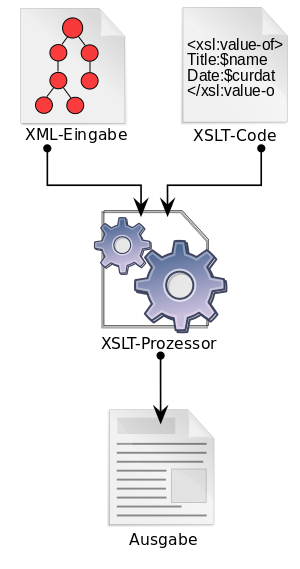

# XSLT 
> XSL Transformation, kurz XSLT, ist eine Programmiersprache zur Transformation von XML-Dokumenten. Sie ist Teil der Extensible Stylesheet Language (XSL) und stellt eine Turing-vollständige Sprache dar.  
>  
> XSLT wurde vom World Wide Web Consortium (W3C) am 8. Oktober 1999 als Empfehlung veröffentlicht. XSLT baut auf der logischen Baumstruktur eines XML-Dokumentes auf und dient zur Definition von Umwandlungsregeln. XSLT-Programme, sogenannte XSLT-Stylesheets, sind dabei selbst nach den Regeln des XML-Standards aufgebaut.
>  
> Die Stylesheets werden von spezieller Software, den XSLT-Prozessoren, eingelesen, die mit diesen Anweisungen ein oder mehrere XML-Dokumente in das gewünschte Ausgabeformat umwandeln. XSLT-Prozessoren sind auch in vielen modernen Webbrowsern integriert, wie zum Beispiel Opera (ab Version 9), Firefox und Internet Explorer Version 5 (ab Version 6 mit vollständiger XSLT-1.0-Unterstützung).
>
> **XSLT ist eine Untermenge von XSL, zusammen mit XSL-FO und XPath.**  
>  
> Anwendungsgebiete für XSLT:
> - POP (Presentation Oriented Publishing)  
>   die Daten werden in XHTML, Formatting Objects (XSL-FO), SVG, SMIL, DocBook und viele andere Formate umgewandelt.
> - MOM (Message Oriented Middleware) 
>   Transformation zum Zwecke des Datenaustausches,


## Funktionsweise
**Vereinfachte Darstellung der Funktionsweise von XSLT**   
Ein XML-Dokument wird mittels eines XSLT-Dokuments und eines verarbeitenden Prozessors in ein neues Dokument überführt (.xml, .xhtml, .html, .txt, …).

 

Eine Transformation besteht aus einer Reihe von einzelnen Transformationsregeln, die Templates heissen.  
Ein Template besitzt ein auf XPath basierendes Pattern, das beschreibt, für welche Knoten es gilt, und einen Inhalt, der bestimmt, wie das Template seinen Teil des Zielbaums erzeugt. 


### Beispiel XSL Template
```xml
<?xml version="1.0" encoding="UTF-8"?>
<xsl:stylesheet version="1.0"
                xmlns:xsl="http://www.w3.org/1999/XSL/Transform">
    <xsl:template match="/">
        <xsl:value-of select="name"/>  <!-- zeigt den inhalt des knotens <name>AAAAA</name> an -->
        <xsl:value-of select="@name"/> <!-- zeigt den wert der attributes <currentNode name="jim"></currentNode> an -->
    </xsl:template>
</xsl:stylesheet>
```
output:
```
    AAAAA
    jim
```
### XSL Template Rules

- `xsl:apply-templates` transformiert die Kindelemente des aktuellen Elements mittels sämtlicher dafür anwendbarer Regeln.
    ```xml
    <xsl:template match="//title">
      <em>
        <xsl:apply-templates/>
      </em>
    </xsl:template>
    ```

- `xsl:call-template` ruft ein template anhand des namens auf, es können parameter übergeben werden.
    ```xml
    <xsl:template match="/">
        <xsl:for-each select="entity/variables/variable">
            <xsl:call-template name="getterAndSetter">
                <xsl:with-param name="name" select="@name" />
                <xsl:with-param name="type" select="@type" />
                <xsl:with-param name="entityType" select="/entity/@name" />
            </xsl:call-template>
        </xsl:for-each>
    </xsl:template>
    
    <xsl:template name="getterAndSetter">
            <xsl:param name="name"/>
            <xsl:param name="type"/>
            <xsl:param name="entityType"/>
        ...
    </xsl:template>
    ```
- `xsl:if`
    ```xml
    <xsl:if test="author/@nationality='U.S.'">*</xsl:if>
    ```
- `xsl:choose`
    ```xml
    <xsl:choose>
      <xsl:when test="...">...</xsl:when>
      <xsl:when test="...">...</xsl:when>
      <xsl:when test="...">...</xsl:when>
      <xsl:otherwise>...</xsl:otherwise>
    </xsl:choose>
    ```
- `xsl:for-each`
    ```xml
    <xsl:for-each select="buch[preis > 10]">
      <xsl:valu-of select="preis" />
    </xsl:for-each>
    ```
- `xsl:sort`
    ```xml
    <xsl:for-each select="buch">
      <xsl:sort select="preis" order="ascending" />
    </xsl:for-each>
    ```
- `CDATA` text unverändert ausgeben
    ```xml
    <xsl:text disable-output-escaping="yes">
      <![CDATA[ ### Hier darf < & >>< beliebiger Text stehen ### ]]>
    </xsl:text>
    ```
- `xsl:import` und `xsl:include` ermöglichen Wiederverwendbarkeit von Style Sheets und modulares Design, include hat eine höhere priorität
    ```xml
    <xsl:stylesheet version="1.0"
            xmlns:xsl="http://www.w3.org/1999/XSL/Transform">
        <xsl:import href="helper.xsl" />
        <xsl:include href="functions.xsl" />
        ...
    </xsl:stylesheet>
    ```
    > Damit der parser dies auflösen kann mus ein URIResolver definiert werden (Java Beispiel)
    ```java
    TRANSFORMER_FACTORY = TransformerFactory.newInstance();
    TRANSFORMER_FACTORY.setURIResolver((href, base) -> {
        final InputStream s = XslTransformerServiceImpl.class.getClassLoader().getResourceAsStream("xsl/" + href);
        return new StreamSource(s);
    });
    ```
  
### XPATH
> Die XML Path Language (XPath) ist eine vom W3-Konsortium entwickelte Abfragesprache, um Teile eines XML-Dokumentes zu adressieren und auszuwerten. XPath dient als Grundlage einer Reihe weiterer Standards wie XSLT, XPointer und XQuery. XPath ist derzeit in der Version 3.1 vom 21. März 2017 standardisiert.  
>
> In Webbrowsern, XSLT-Prozessoren und anderer Software wird oft nur die XPath-Version 1.0 aus dem Jahr 1999 unterstützt, vereinzelt auch die XPath-Version 2.0 von 2007. 
  
Ein XPath-Ausdruck adressiert Teile eines XML-Dokuments, das dabei als Baum betrachtet wird, wobei einige Unterschiede zum „klassischen“ Baum der Graphentheorie zu beachten sind:

- Knoten (nodes)  
    sind der Dokumenten-Knoten, XML-Elemente, -Attribute, -Textknoten, -Kommentare, -Namensräume und -Verarbeitungsanweisungen.  

- Die Achsen `preceding`, `following`, `preceding-sibling` und `following-sibling` orientieren sich nicht allein an der Baumstruktur, sondern auch an der Reihenfolge der Deklaration der Elemente im XML-Dokument (Linked-Tree).

#### Ausdrücke

- `/dok` 	
    das erste Element dok
- `/*` 	
    das äußerste Element unabhängig vom Namen (jedes wohlgeformte XML-Dokument hat genau ein äußerstes Element), hier dok
- `//dok/kap` 	
    alle kap-Elemente innerhalb aller dok-Elemente
- `//dok/kap[1]` 	
    alle jeweils ersten kap-Elemente innerhalb aller dok-Elemente
- `//pa` 	
    alle pa-Elemente auf allen Ebenen
- `//kap[@title='Nettes Kapitel']/pa` 	
    alle Absätze der Kapitel mit Titel „Nettes Kapitel“.
- `//kap/pa[2]` 	
    Jeweils das zweite pa-Element in den beiden Kapiteln.
- `//kap[2]/pa[@format='bold'][2]` 	
    Zweite Zeile mit dem Format 'bold' im 2. Kapitel.
- `child::*` 	
    alle Kindelemente des gegenwärtigen Knotens
- `child::pa` 	
    alle pa-Kinder des gegenwärtigen Knotens
- `child::text()` 	
    alle Textknoten des gegenwärtigen Knotens
- `.` 	
    der gegenwärtige Knoten
- `./*` 	
    alle Kindelemente des gegenwärtigen Knotens
- `./pa` 	
    alle pa-Kinder des gegenwärtigen Knotens
- `pa` 	
    alle pa-Kinder des gegenwärtigen Knotens
- `attribute::*` 	
    alle Attribute des gegenwärtigen Knotens
- `namespace::*` 	
    alle Namespaces des gegenwärtigen Knotens
- `//kap[1]/pa[2]/text()` 	
    Textinhalt des zweiten pa-Elements im ersten kap-Element (also "Noch ein Absatz") 

### XSL Conflict Resolution
Conflict Resolution wird dann benötigt, wenn ein Knoten zu mehreren Template Rules gleichzeitig passt. In solchen Fällen gelten die folgenden Regeln.

- Importierte Regeln haben niedrigere Priorität.
- Wenn ein Attribut priority gegeben ist, wird es berücksichtigt.
- Spezifischere Patterns haben höhere Priorität als weniger spezifische. So ist beispielsweise der Test, ob irgendein Knoten existiert, weniger spezifisch als ein Test für einen Knoten mit konkretem Namen.
- Wenn es mehrere gleichberechtigte Regeln gibt, ist das ein Fehler, und wird vom XSLT-Parser als Meldung ausgegeben.
                                                                                                                                                                                                                                                                                                                                                                            
### XSL Funktionen

- aufruf von `concat` (standard function)
    ```xml
    <xsl:sort select="concat('Hello', ' ', 'World!')" />
    ```
> `exsl` bietet eine weitere palette von funktionen an, welche über den namespace importiert werden können.  
>Dabei ist es wichtig dass der unterliegende XST-Transformer diese auch verarbeiten kann.


- aufruf von `math:lowest` (exsl function)
    ```xml
    <xsl:stylesheet version="1.0"
              xmlns:xsl="http://www.w3.org/1999/XSL/Transform"
              xmlns:math="http://exslt.org/math"
              extension-element-prefixes="math">
        <xsl:template match="order">
            <xsl:value-of select="math:lowest(price/*)" />
        </xsl:template>
    </xsl:stylesheet>
    ```

- aufruf von `ggq:toUpperCase` (custom java method, xalan parser needed)
    ```xml
    <xsl:stylesheet version="2.0"
                  xmlns:xsl="http://www.w3.org/1999/XSL/Transform"
                  xmlns:xalan="http://xml.apache.org/xalan"
                  xmlns:ggq="xalan://ch.hftm.ggq.xsl.GGQ">
        <xsl:template match="/">
            <xsl:value-of select="ggq:toUpperCase($PARAM_01)" />
        </xsl:template>
    </xsl:stylesheet>
    ```
  
    ```java
    package ch.hftm.ggq.xsl;
    
    import java.util.Optional;
    
    public class GGQ {  
  
      private static final String EMPTY_STRING = "";
  
        public static String toUpperCase(String str) {
            return Optional.ofNullable(str)
                    .map(String::toUpperCase)
                    .orElse(EMPTY_STRING);
        }
    }
    ```
  
## Quellen

- https://www.w3.org/TR/xslt/  
- https://de.wikipedia.org/wiki/XSL_Transformation